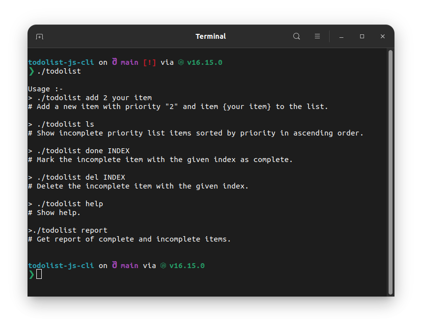
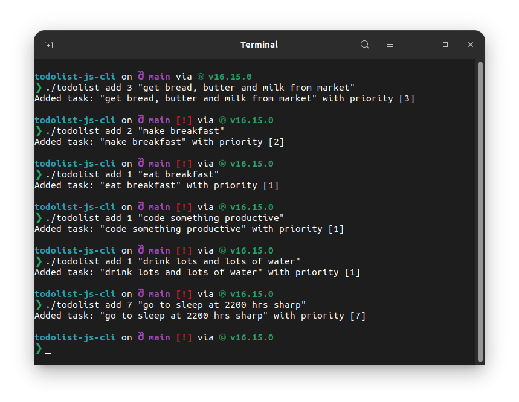
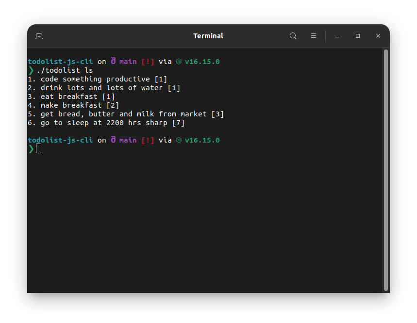
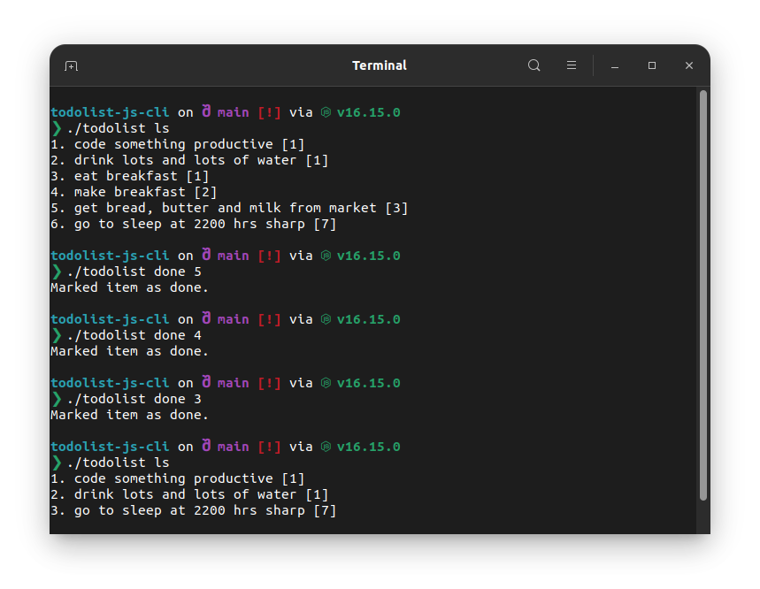
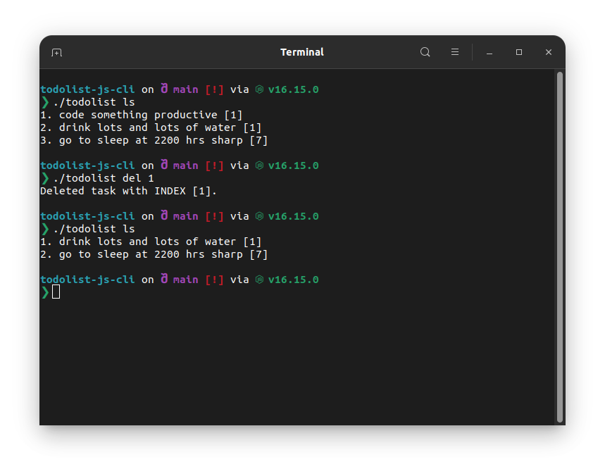
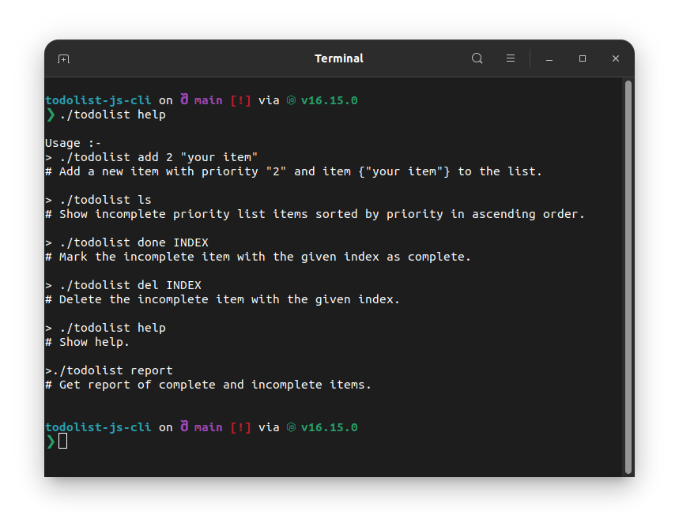
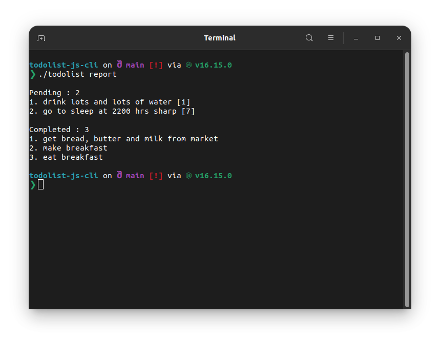

# todolist-js-cli

- Command line based To Do List.
- Built with JavaScript .
- functionality: `add, done, delete, show, report`.

## Usage (for Linux)

```
./todolist
```



```
./todolist add 2 "your item"
```

Add a new item with priority "2" and item {"your item"} to the list.


```
./todolist ls
```

Show incomplete priority list items sorted by priority in ascending order.


```
./todolist done INDEX
```

Mark the incomplete item with the given index as complete.


```
./todolist del INDEX
```

Delete the incomplete item with the given index.


```
./todolist help
```

Show help.


```
./todolist report
```

Get report of complete and incomplete items.


## For windows

edit file `todolist`

```
@echo off
node index.js %1 %2 %3
```
